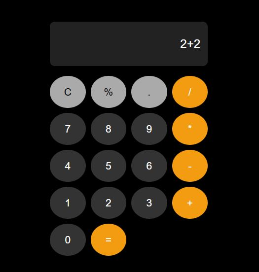
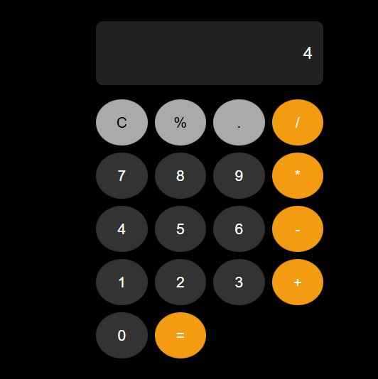
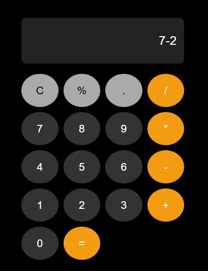
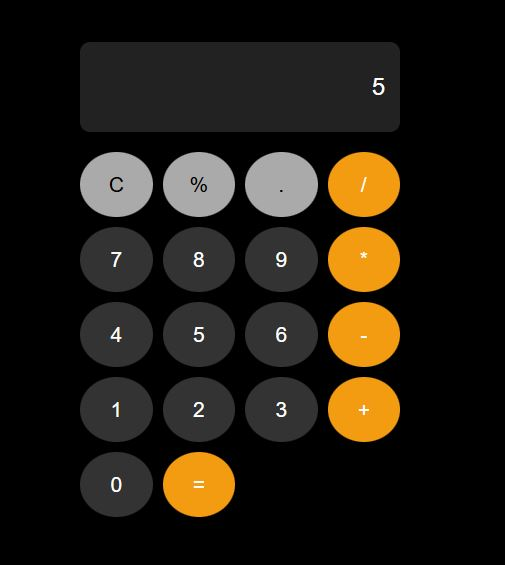
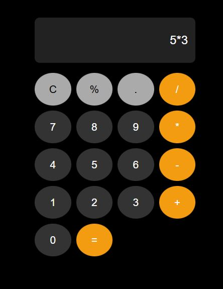
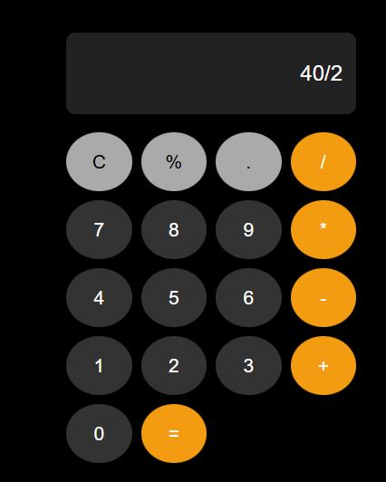
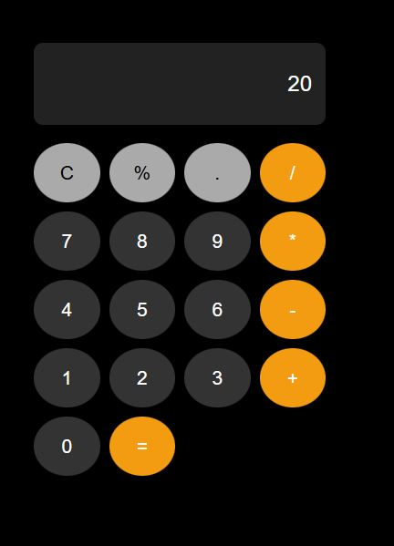

# programacao-js
# Calculadora JavaScript

# Descrição

Calculadora desenvolvida utilizando HTML, CSS e JavaScript, capaz de realizar as operações básicas de soma, subtração, multiplicação e divisão.

# Implementação

O HTML foi utilizado para criar a estrutura da calculadora, incluindo o visor e os botões numéricos e de operações.

O CSS foi utilizado para estilizar a interface, definindo cores, tamanhos e o posicionamento dos elementos.

O JavaScript foi responsável pela lógica da aplicação. As funções appendNumber() e appendOperator() adicionam números e operadores ao visor. A função calculate() realiza o cálculo da expressão digitada e exibe o resultado na tela. Já a função clearDisplay() limpa o conteúdo do visor para iniciar uma nova operação.

# Somar

# Subtrair

# Multiplação

![Multiplicacao][def]

# Divisão

[def]: img/multi/multi-resul.JPG